 

 

I build end-to-end web applications — from database to UI. Comfortable across the stack with Python and Java on the backend, and React, Node, and TypeScript on the front.

 

 

 

[Email](mailto:smith04@my.yorku.ca) · [LinkedIn](https://linkedin.com/in/smith-patel-778004233) · [Portfolio](https://smithpatel.com)

